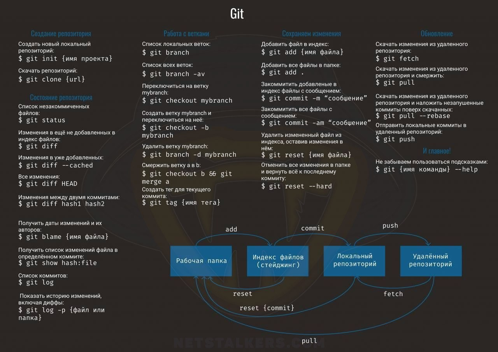

# Git Cheat Sheet


## Создание репозитория
Создать новый локальный репозиторий:
```bash
$ git init [имя проекта]
```
Скачать репозиторий:
```bash
$ git clone {url}
```

## Состояние репозитория
Список незафиксированных файлов:
```bash
$ git status
```
Изменения в ещё не добавленных в индекс файлах:
```bash
$ git diff
```
Изменения в уже добавленных файлах:
```bash
$ git diff --cached
```
Все изменения:
```bash
$ git diff HEAD
```
Изменения между двумя коммитами:
```bash
$ git diff hash1 hash2
```
Получить даты изменений и их авторов:
```bash
$ git blame [имя файла]
```
Получить список изменений файла в определённом коммите:
```bash
$ git show hash:file
```
Список коммитов:
```bash
$ git log
```
Показать историю изменений, включая диффы:
```bash
$ git log -p [файл или папка]
```

## Работа с ветками
Список локальных веток:
```bash
$ git branch
```
Список всех веток:
```bash
$ git branch -av
```
Переключиться на ветку mybranch:
```bash
$ git checkout mybranch
```
Создать ветку mybranch и переключиться на неё:
```bash
$ git checkout -b mybranch
```
Удалить ветку mybranch:
```bash
$ git branch -d mybranch
```
Смержить ветку a в b:
```bash
$ git checkout b && git merge a
```
Создать тег для текущего коммита:
```bash
$ git tag [имя тега]
```

## Сохранение изменений
Добавить файл в индекс:
```bash
$ git add [имя файла]
```
Добавить все файлы в папке:
```bash
$ git add .
```
Закоммитить добавленные в индекс файлы с сообщением:
```bash
$ git commit -m "сообщение"
```
Закоммитить все файлы с сообщением:
```bash
$ git commit -am "сообщение"
```
Удалить изменённый файл из индекса, оставив изменения в нём:
```bash
$ git reset [имя файла]
```
Отменить все изменения в папке и вернуть всё к последнему коммиту:
```bash
$ git reset --hard
```

## Обновление
Скачать изменения из удалённого репозитория:
```bash
$ git fetch
```
Скачать изменения из удалённого репозитория и смерджить:
```bash
$ git pull
```
Скачать изменения из удалённого репозитория и наложить незашитанные коммиты поверх скачанных:
```bash
$ git pull --rebase
```
Отправить локальные коммиты в удалённый репозиторий:
```bash
$ git push
```

## Полезные советы
Не забываем пользоваться подсказками:
```bash
$ git [имя команды] --help
```

---


